# bbbbb

<p align="center">
  
</p>

<p align="center">
  <strong>Know the moment your work needs you.</strong><br>
  A private iPhone inbox for coding-agent and service updates.
</p>



<p align="center">
  <a href="https://apps.apple.com/us/app/bbbbb-coding-agent-alerts/id6791204016"><strong>Download bbbbb on the App Store</strong></a>
  ·
  <a href="https://bbbbb.app/">Visit bbbbb.app</a>
</p>

You kicked off a build. Your coding agent hit a question. A deploy needs approval. bbbbb (“B-five”) puts that moment on your iPhone—and keeps the update in your inbox.

Notifications disappear; bbbbb is built for follow-through:

- **Attention** holds questions, failures, approvals, and to-dos until resolved.
- **Activity** keeps other updates easy to scan.
- **Sources send, but never read** your inbox or run commands.

Connect with a temporary QR or six-digit code, then send through HTTP. The optional CLI wraps finite commands.

## Quick start

### HTTP — No CLI required

1. Open [Connect](https://bbbbb.app/connect/) on the sender.
2. Name the Source and approve it on iPhone.
3. Save the collected link as `BBBBB_SOURCE_URL`, then send:

```sh
curl -X POST "$BBBBB_SOURCE_URL"
```

The category is chosen by the sender: Attention may need a response; everything else is Activity. Keep the Source URL out of prompts and logs.

### Optional CLI

```sh
npm install --global @bbbbbapp/cli
bbbbb setup --name "My Mac"
bbbbb run -- npm test
```

If npm is unavailable, use a verified [GitHub Release](https://github.com/xxsang/bbbbb/releases). See [Install the CLI](docs/guides/CLI_SOURCES.md).

### Coding-agent skill

Install:

```sh
sh scripts/install-bbbbb-notify-skill.sh
```

Prompt:

> Use bbbbb for this task. Notify me when it finishes. Send Attention only if I need to act. No progress updates.

## Guides

| Task | Guide |
| --- | --- |
| Choose a setup | [Installing](docs/guides/INSTALLING.md) |
| Coding agent, webhook, or script | [HTTP Source](docs/guides/HTTP_SOURCES.md) |
| Install the CLI | [CLI Source](docs/guides/CLI_SOURCES.md) |
| macOS, Linux, or Windows | [Platform guides](docs/guides/INSTALLING.md) |
| Self-hosting and operations | [Operations](docs/launch/OPERATIONS.md) |

## Plans and limits

Free includes every core feature: 1,000 updates per rolling 30 days and encrypted catch-up for the newest 100 for up to seven days.

**Plus: US$4.99, paid once—future features included.** Not a subscription. First 60 days after launch. Core stays free; Plus adds more updates, 30-day catch-up, and export. Regular price: US$6.99 once from October 26, 2026.

Plus raises the rolling limit to 10,000, keeps the newest 500 encrypted updates for up to 30 days, and adds on-device JSON/CSV export.

There is no daily customer quota. Every Inbox has a shared 20-submission-per-minute safety limit, and adding Sources does not add capacity.

## Privacy

CLI events leave encrypted; HTTP events are sealed before storage. Free keeps the newest 100 encrypted events for up to seven days; Plus keeps the newest 500 for up to 30 days. Sources can send but cannot read history, and a missed banner does not mean a missed update.

The developer core is licensed under the [Apache License 2.0](LICENSE). The iPhone app is separate.
