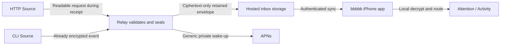

# bbbbb v1.1 Design

## Design principles

1. **First value before configuration** — create one Source and prove one real event before offering advanced choices.
2. **One product, two sending methods** — HTTP and CLI produce the same Inbox Event and iPhone experience.
3. **Safe defaults, progressive disclosure** — setup asks only for Source name; advanced information is optional and contextual.
4. **Ciphertext-only retention** — no accepted event has a plaintext storage representation.
5. **Independently revocable senders** — every v2 Source has its own write authority and cannot read inbox history.
6. **Sender-controlled timing and routing** — the sender chooses when to notify and explicitly routes the event to Activity or Attention; no model call or text heuristic infers lifecycle.
7. **Durable inbox, best-effort alert** — relay acceptance is the record; APNs only prompts the owner to sync.
8. **Clean launch boundary** — v1.1 starts on protocol 2 without carrying earlier v1 senders, keys, history, or migration behavior.

## System boundary



The system remains four pieces:

- **iPhone app** — approves Sources, stores private key material, decrypts retained events, and provides the local inbox.
- **Relay** — creates short-lived pairing sessions, authenticates Source writes, validates bounds, seals HTTP submissions, retains ciphertext, and requests APNs wake-ups.
- **HTTP Source** — a write-only URL usable by any HTTPS client.
- **CLI Source** — a locally installed sender that validates and encrypts before transmission.

The website supports pairing, documentation, help, privacy, and trust. It is not an inbox or remote-control surface.

### Surface-design scope

V1.1 requires a **targeted iPhone interaction redesign**, not a wholesale visual rebrand. The quiet visual character remains, while the inbox uses red **Attention** and green **Activity** tabs. Add Source approval, adaptive cards, event detail, Source management, settings, empty states, and failure feedback are built around real configurable information.

The Add Source webpage is a **new task-specific setup flow**, not a redesign of the public website and not a web inbox. It needs explicit session creation, QR or same-phone code, waiting, approved, test-send, success, expiry, and secret-safe failure states. Documentation, privacy, and trust pages may keep their current presentation unless usability or accessibility evidence identifies a separate problem.

Both surfaces are designed together before protocol or relay implementation fixes their interaction model.

## Domain model

### Source

A Source is one stable origin of events with:

- opaque Source ID;
- owner-visible name;
- fixed sending method: HTTP or CLI;
- independently revocable write credential;
- enabled or disabled state;
- creation, replacement, and last-success timestamps; and
- no authority to read, decrypt, delete, or manage inbox history.

Source name is the only visible Source label. The request cannot rename or re-identify its Source.

V1.1 does not convert a Source between HTTP and CLI. A user who wants the other method creates another Source. This avoids breaking unknown scripts that still use an HTTP URL and removes an upgrade transaction from the launch path.

### Inbox Event v2

The canonical event after validation is:

```json
{
  "version": 2,
  "eventId": "018f6f18-7f2f-7d3d-a932-70a79fbe31a4",
  "sourceId": "opaque-source-id",
  "source": "nightly iOS build",
  "sourceMethod": "cli",
  "category": "activity",
  "label": "Started",
  "occurredAt": "2026-07-18T10:42:00Z",
  "work": "Run release tests",
  "message": "Running on the release host",
  "details": {
    "commit": "abc1234",
    "duration_minutes": 18,
    "cached": false
  }
}
```

Canonical required fields are `version`, `eventId`, `sourceId`, `source`, `category`, and `occurredAt`. `category` is exactly `attention` or `activity`. `label`, `work`, `message`, and `details` are optional bounded sender content; first-party ingress supplies the neutral label `Update` when omitted. An empty HTTP request therefore becomes `Activity · Update`. A CLI sender creates the same canonical fields locally before encryption, except that Source identity and name must match the credential-bound Source record.

First-party senders authenticate `sourceMethod` as `http` or `cli`. The iPhone retains the authenticated `sourceId` with each local event and derives deterministic artwork from it. The same Source keeps the same artwork across the Sources list, Attention, Activity, and event detail—even after a rename or list reorder. The sending method appears as a small artwork badge and explicit detail text.

`category` routes the event; it does not claim that a job finished. `label` carries the sender's state wording, so `Started`, `Succeeded`, `Failed`, `Cancelled`, `Waiting`, and domain-specific labels are all valid. User-controlled HTTP and CLI senders may create an event at any time. Only `bbbbb run` is lifecycle-opinionated because it observes a finite child process.

`work` and `message` are optional bounded strings. `details` is optional and contains at most 12 flat entries whose values are bounded strings, finite numbers, or booleans. Nulls, arrays, nested objects, Markdown, HTML, logs, binary data, secrets, metric histories, and executable content are rejected.

Action links are not part of the v1.1 launch event. They may return later through a separately reviewed Source-level hostname boundary after the basic update loop is proven.

## Cryptographic and authorization design

### Inbox key

The iPhone owns an inbox public/private encryption keypair. The public key may be registered with the relay and issued to approved CLI Sources. The private key never leaves the trusted iPhone recovery boundary.

The exact recovery derivation and supported key-storage behavior must be frozen by the protocol-and-crypto feasibility gate. A CLI Source receives only the inbox public key and its own write credential; it never receives private decryption material or inbox-wide authority.

### One v2 encryption form

Both new sending methods produce the same protocol-v2 sealed event format:

- HTTP: relay validates plaintext request fields and immediately seals the canonical event to the inbox public key.
- CLI: sender validates and seals the canonical event to the same inbox public key before submission.

The relay stores only the sealed envelope. The envelope binds at least Channel/inbox ID, Source ID, event ID, protocol version, and cryptographic suite as authenticated data so cross-Source or cross-inbox relabeling fails.

The exact standards-based HPKE suite is selected only after compatible Worker, Node/standalone CLI, and supported-iOS fixtures pass. If the proof fails, design review resumes; no custom cryptography silently replaces it.

### Source credential

Each Source receives one high-entropy write credential approved by the iPhone:

- HTTP embeds it in the Source URL.
- CLI stores it in an owner-only local profile.
- The relay stores only the credential hash.
- Credential possession authorizes bounded submission for that Source only.
- Replacement invalidates the previous credential immediately after the new value is safely issued.
- Disable and delete reject new writes without rewriting retained history.

Automatic setup and generated sender code use `BBBBB_SOURCE_URL` or a secret-store reference. They do not commit, log, place in QR payloads, include in approval text, or echo the raw value.
The default coding-agent/computer journey is requester-first. The browser, CLI, or supported client that needs sending access creates the temporary Add Source session and retains its high-entropy setup secret. After iPhone approval, that requester collects the Source’s first credential directly. A new Source therefore does not create one credential on iPhone and immediately rotate it to another device.

The private Source link is masked by default. Explicit Reveal, Copy, Share, Download, and **Copy setup for coding agent** actions may disclose it to a destination the owner intentionally selected. The coding-agent action may include the link together with an instruction to keep it in a local, Git-ignored `BBBBB_SOURCE_URL` setting and never commit it. No automatic path places the value in page URLs, browser storage, cookies, analytics, logs, screenshots, QR payloads, product-review notes, or generated public examples.

For a webhook or service that cannot initiate requester-first setup, the app may create one manual HTTP Source and display its private link once for owner-directed placement. Anyone with read access can send as that Source. Replace or delete revokes exposed or lost access.

## Add Source

### Session

The sending destination starts one five-minute, single-use session. It supports three presentations:

1. **Browser** — a trusted visible page displays a QR.
2. **Terminal** — the optional CLI renders the large QR; compact output is an explicit narrow-terminal fallback.
3. **Same phone** — a short temporary code avoids scanning the phone's own display.

The requester retains a high-entropy setup secret. The session QR or code contains only temporary approval material, never a permanent credential, setup secret, or private key. Expiry before requester collection creates no Source.

### Approval

The iPhone is the only Source-approval authority. The requester supplies the Source name and sending method; approval presents them as read-only context with one concise trust sentence. The app does not claim that a requester-provided name authenticates a physical computer or person.

The ordinary approval meaning is:

- **Add “MacBook builds”?**
- “The device showing this code can send updates as this Source. It cannot read your inbox.”
- “Only continue if you started the request on that device.”
- **Add Source**

The Sources hierarchy recommends **Coding agent or computer**. **Webhook or service** is the manual app-created fallback. CLI creation remains a separate, deliberate sending method for encryption before transmission and command wrapping; it is not required for first value.

Defaults are safe and not configurable during first setup:

- no action links;
- bounded event fields only;
- no request-side Source identity override;
- generic APNs; and
- existing hosted retention.

### Credential handoff and proof

After approval, only the requester holding the session setup secret can collect the first credential. Requester collection atomically creates the Source. CLI setup stores the result in its supported protected store. The browser keeps the private Source link in memory only and offers explicit agent-copy, link-copy, reveal, and environment-file download actions.

For a coding agent, the primary browser action copies one bounded setup instruction that may deliberately contain the private Source link. It tells the agent to store the value locally as `BBBBB_SOURCE_URL`, keep it out of Git, and send one bounded test. The browser cannot claim that Copy or Download securely stored the value.

Onboarding completes only after an event from the configured external sender is accepted and appears on the iPhone. An app-generated or browser-generated relay check proves credential acceptance only. For a manual app-created Source, the app records the exact synthetic check event ID and excludes only that event from completion; label or work-string matching is insufficient.

The app may persist only non-secret onboarding context needed to resume this wait: Source ID, name, method, requester/manual origin, session expiry, and current milestone. It never persists the private Source link, setup secret, claim proof, QR payload, or six-digit code.

Provider-specific secret creation and CI/CD integration are outside the generic onboarding contract. Owners may manually place the credential in any provider-supported secret field.

### Existing Source access movement

Credential transfer is not new-Source onboarding. It is an advanced **Move sending access** action for an existing enabled HTTP Source. The app states that the old private Source link will stop working and requires explicit **Move access** confirmation.

The receiving browser or headless server creates an RSA-OAEP 4096 keypair and registers only its public key plus a bounded receiver label. The QR, six-digit code, and pairing link contain temporary proof, never the Source link. Successful completion atomically rotates the existing Source credential, stores its hash, and retains only the replacement-link ciphertext. The receiver consumes that ciphertext once and decrypts locally; its private key never leaves the receiving device.

The current headless behavior remains advanced and unchanged: existing `curl` and `openssl`, validation before replacement, an owner-only file, and no credential output. A shorter reviewed script may package the same behavior, but must not use `curl | sh` or change the transfer protocol.

## Ingress

### HTTP request

The default endpoint accepts an empty body, form data, or bounded JSON. Empty input becomes `Activity · Update`. Accepted request fields are `category`, `label`, `work`, `message`, and `details`.

Processing order is fixed:

1. authenticate Source credential;
2. enforce Source and inbox rate limits before expensive work;
3. read a bounded body;
4. validate fields and the explicit category;
5. supply canonical server fields;
6. seal to the registered inbox public key;
7. durably store the sealed envelope with idempotent event identity;
8. request a generic APNs wake-up; and
9. return durable acceptance independently of APNs presentation.

No plaintext event column, analytics field, log entry, queue payload, or support record is created.

### CLI submission

The CLI:

- reads an owner-only Source profile;
- supports explicit send and finite command wrapping;
- lets `send` create an Activity or Attention event whenever the caller chooses;
- lets `run` map only objective exit/cancellation signals to terminal labels;
- validates the same bounds as the relay;
- creates the canonical event;
- encrypts to the inbox public key;
- authenticates with its Source credential; and
- uses bounded retries that reuse the same event ID.

The CLI cannot fetch or decrypt inbox history. Notification failure never changes the wrapped command's real exit code.

## Storage, retention, and synchronization

- History contains protocol-2 sealed envelopes only.
- The iPhone decodes one protocol-2 Inbox Event model.
- Every retained event is attributable to an independently revocable Source.
- Earlier databases, keys, senders, and retained events are not imported or migrated.
- The hosted service retains at most the newest 100 envelopes and at most seven days.
- Daily abuse and cost limits remain explicit and protection-neutral.
- Durable acceptance is idempotent by event ID; an optional caller idempotency key may map to that identity for HTTP retry.
- Hosted deletion removes retained envelopes and alert registration according to the existing explicit deletion contract.
- Local resolution and synchronized local history remain iPhone-only state.

## iPhone design

The redesign preserves the proven two-tab mental model but treats the reviewed setup, card, detail, settings, and feedback problems as launch blockers. Existing components are reused only when they already express the accepted behavior clearly; visual novelty is not a goal.

### Inbox

- Normal launch opens Attention.
- Attention and Activity empty states remain tab-local.
- Cards adapt to sparse or rich events without empty placeholders.
- State color never competes with arbitrary Source color.
- Resolve with Undo remains local.
- Generic notification tap synchronizes and selects the relevant tab without claiming an exact event when the push contains no identifier.

### Detail

Detail renders only accepted data: complete message, bounded details, exact time, Source, category, label, and honest technical provenance when helpful. It contains no fabricated run number, protocol decoration, protection badge, or configurable field that was absent.

### Source management

The Sources section appears only when all launch actions work end to end:

- list and inspect;
- rename;
- send test;
- replace credential;
- disable or re-enable; and
- delete.

Sources is a first-class destination alongside Attention and Activity. Its Add Source action has one recommended coding-agent/computer route and one manual webhook/service fallback; it does not expose a second “pair browser or CLI” entry.

Source information names the actual sending method and provides the relevant trust explanation. It does not expose Protection Mode, policy revision, suite, downgrade, or protocol controls.

Settings contains no fixed facts styled as controls. Retention, local resolution, notification privacy, and cryptographic explanations belong in Help/privacy or contextual captions.

## Notifications

V1.1 requires a generic APNs wake-up for both Source methods. APNs payloads contain no work, Source, message, details, category, label, credential, inbox identity, or action.

Classification-only previews and exact-event notification navigation are feasibility experiments, not launch dependencies. They ship only if they preserve relay blindness, work under supported iOS preview settings, and improve comprehension reliably. Otherwise generic alerts remain truthful.

## Error contract

Public errors are bounded, secret-safe, and stable enough for scripts. They distinguish authentication, disabled/revoked Source, invalid input, quota, duplicate acceptance, temporary relay failure, and successful acceptance. Local tools separately identify DNS, TLS, timeout, and restricted-egress failures without calling the relay unavailable from sandboxed evidence alone.

The agent setup skill runs a read-only authenticated check first. When a sandbox blocks outbound access, it requests only the configured relay and intended check/send operation through that environment's normal permission mechanism.

## Clean protocol-2 boundary

- V1.1 reads, writes, synchronizes, and retains protocol 2 only.
- There is no protocol-v1 sender coexistence, history import, key conversion, action-link migration, or upgrade UI.
- Users reset or reinstall the app and recreate Sources before using v1.1. Any protocol-v1 relay history is treated as disposable.
- Frozen v1 code, fixtures, artifacts, and evidence remain archived for engineering reference; they do not constrain the v1.1 runtime contract.
- Product version v1.1 preserves the product identity and learned user problem, not wire or data compatibility.
- Compatibility promises begin at the v1.1 boundary.

## Publication and self-hosting boundary

This repository contains the protocol, CLI, relay, fixtures, and the documentation required to audit them, under Apache-2.0. The iOS app is not included.

Turnkey supported self-hosting is not yet offered. It depends on installation, upgrade, APNs credentials, backup, recovery, abuse controls, and security updates having an independently maintainable user journey.

## Rejected launch alternatives

- Mandatory CLI or npm installation for first value.
- Asking users to choose a Protection Mode during ordinary setup.
- Separate quick and advanced products or inboxes.
- Separate Source and event-source labels.
- Per-Source policy control planes during onboarding.
- Two new v2 content-encryption suites when one public-key envelope can serve both methods.
- Issuing any inbox-wide read or decryption secret to a Source.
- In-place HTTP-to-CLI conversion before usage evidence justifies its operational risk.
- Classification previews that reveal category or label before unlock.
- Arbitrary action links before the core update loop is proven.
- Turnkey self-hosting as a prerequisite for the hosted first-value path.

## Feasibility gates

The highest-risk proofs are:

1. standards-based HPKE interoperability across Worker, CLI, and supported iOS;
2. protocol-2 decoding, offline recovery, duplicate handling, and corrupt-event fallback;
3. no-install browser setup with QR, same-phone code, and requester-owned first credential;
4. end-to-end first Source and first external sender event within three minutes;
5. credential replacement with exactly one active secret after failure or success; and
6. restricted-environment network diagnostics without credential disclosure.
